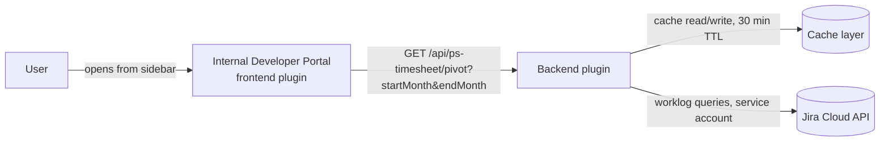

# PS TimeSheet

A Jira worklog pivot tool — turns raw Jira worklogs into ready-to-use monthly reporting views for finance and engineering leadership.

> This README describes the real architecture behind the tool, with internal URLs, credentials, and infrastructure identifiers redacted/genericized. It documents a pattern, not a runnable standalone repo — see [A note on reuse](#a-note-on-reuse).

## Why time tracking matters

Every hour logged in Jira is a signal: how much capacity goes to maintenance vs. new features, which project is actually eating the budget, whether next sprint's commitment is realistic given real team load. That data feeds three audiences directly — finance (cost allocation, billing), engineering leadership (capacity planning, squad-level trade-offs), and continuous improvement (where time actually goes vs. where it was planned to go).

The gap: Jira logs time per ticket, not per project or per person. Without aggregation, that data stays locked in individual issues — someone has to export it and rebuild the same pivot table by hand, every month, per squad.

## What this solves

PS TimeSheet queries the Jira API for worklogs over a selected month range and turns them into two views, with no manual spreadsheet work:

- **Pivot** — cross-table of Jira space × person × month, split into Maturation / Build. Clicking a space row expands the per-developer breakdown; a grand total row aggregates all spaces.
- **Summary** — aggregated view per person over the full selected period, with a Maturation / Build distribution bar.

Default range covers the last 3 months. Time is reported in days, using a fixed conversion of **1 day = 7.8 hours** of logged Jira time.

## Business logic: issue categorization

Every worklogged issue is bucketed by its Jira issue type:

| Jira issue type | Category |
|---|---|
| Epic | Maturation |
| Spike | Maturation |
| Any type containing "opportunit" | Maturation |
| Story | Build |
| Subtask / Sub-task | Build |
| Improvement | Build |
| Any other type | Ignored |

## Architecture

PS TimeSheet isn't a standalone app — it's a **plugin pair inside the company's internal Developer Portal** (a Backstage instance): a frontend plugin rendered in the portal's sidebar, and a backend plugin that owns the Jira integration.

- **Frontend** — a Developer Portal page. Sends a single request per query (`startMonth`, `endMonth`) to the backend and renders the pivot/summary views client-side.
- **Backend** — fetches worklogs from Jira using a shared service-account token, applies the categorization rules above, and caches the aggregated result for 30 minutes to avoid hammering the Jira API on repeated queries.
- **Deployment** — ships as part of the Developer Portal's own release: packaged with Helm, deployed to Kubernetes across several environments (review/feature environments, preproduction, production), rolled out through GitOps.

## Security considerations

**What's in place:**
- Access to the tool itself is inherited from the Developer Portal's own SSO — there's no separate login screen or credential entry for end users
- The Jira token is held only in a managed secrets store, injected into the runtime at deploy time — never committed to git, never held in a local `.env` in any real environment
- The backend is the only component that ever sees the Jira token; the frontend never touches credentials

**Known limitations:**
- Jira access uses one **shared service account**, not per-user OAuth — simplest model for a small internal reporting tool, but it means no per-user audit trail on the Jira side, and rotating the token is a manual, multi-environment runbook step today rather than an automated flow
- Authorization is all-or-nothing: anyone who can reach the Developer Portal page can query any space/person in the pivot — there's no row-level permission model
- No rate limiting beyond the cache — a cold cache combined with a wide date range could still generate a burst of Jira API calls

## Infrastructure & deployment

- Two plugins (frontend + backend) living inside the company's Developer Portal monorepo — not deployed independently
- Configuration (Jira base URL, service account identity, cache TTL) is environment-specific, set via Helm values per environment; secrets are injected separately through a managed secrets manager, never stored alongside config
- Multiple environments: short-lived review/feature environments, preproduction, production — deployed through a GitOps pipeline, so a config or logic change ships as PR → merge → new release, not a manual server restart

## Design decisions & trade-offs

- **Shared service account over per-user OAuth** — fastest path to ship a low-traffic internal reporting tool without building a full OAuth consent flow; the explicit trade-off is a coarser audit trail and a single credential to rotate across every environment.
- **30-minute cache TTL** — worklogs don't need to be real-time for monthly reporting, so caching trades a small staleness window for meaningfully lower load on the Jira API.
- **Plugin inside the Developer Portal rather than a standalone app** — piggybacks on the portal's existing SSO, hosting, and release pipeline instead of building auth and infrastructure from scratch, at the cost of the tool only being usable by people with Developer Portal access.

## A note on reuse

This repo documents the real architecture and business logic (categorization rules, pivot structure, caching strategy) but strips out anything specific to the company's infrastructure — internal URLs, the service account's identity, secrets manager references, and internal repo paths are intentionally not reproduced here.

Because the tool is wired into an internal Developer Portal, an internal Jira instance, and internal secrets, this repo can't be cloned and run standalone as-is. If you want a version that can — a small independent script/app implementing the same worklog-fetch → categorize → pivot → cache logic against any Jira Cloud instance — that's a different, buildable project; happy to put that together as a separate piece if useful.

## Roadmap

- Move from a shared service account to per-user Jira OAuth for a real audit trail
- Automate service-account token rotation instead of the current manual runbook
- Add row-level authorization (restrict who can query which space/person)
- Expand issue categorization rules as new Jira issue types are introduced

## Notes

- This started as an internal reporting need and is now a permanent plugin in the company's Developer Portal; this document is the portfolio-safe writeup of that work, not the deployable source
